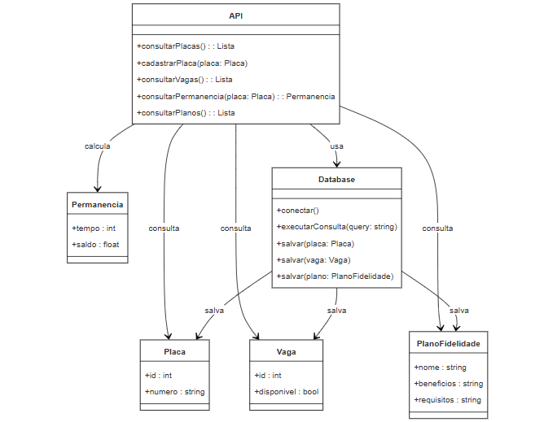

# Sistema-de-Estacionamento

## Primeira Tarefa

### Objetivos e Principais Features
Nosso sistema visa a implementar um software que poderia ser usado por um estacionamento a fim de organizar o fluxo de carros presentes.

Algumas features sugeridas:
1. cadastrar placa de carro;
2. conferir disponibilidade de vagas;
3. localizar veículo estacionado pela placa;
4. conferir tempo de permanência do veículo pela placa e gerar saldo a ser pago;
5. dar baixa em uma placa quando o veículo for retirado;
6. verificar quantidade de vezes em que um cliente já frequentou o sistema;
7. aplicar desconto segundo plano de fidelidade.

### Membros da Equipe e Papéis no Sistema
1. Arthur Felipe Ferreira 2019070000 (frontend)
2. João Guilherme Marcondes de Souza Costa 2019027636 (full)
3. Júlia Paes de Viterbo 2021032137 (backend)

### Tecnologias
O grupo pretende desenvolver o sistema por meio da linguagem Python e de ferramentas de Bancos de Dados.

## Backlog do Produto
Nosso sistema é voltado apenas para os funcionários do estacionamento.

Seguem as histórias de usuário:
1. como funcionário, eu gostaria de cadastrar uma nova placa de um veículo;
2. como funcionário, eu gostaria de consultar a disponibilidade de vagas não ocupadas no momento atual;
3. como funcionário, eu gostaria de saber os números identificadores das vagas disponíveis;
4. como funcionário, eu gostaria de, dado o número de uma vaga, saber a localização dela dentro do estacionamento;
5. como funcionário, eu gostaria de, dado o número de uma placa, localizar onde está o veículo ao qual ela pertence dentro do estacionamento;
6. como funcionário, eu gostaria de, dado o número de uma placa, consultar o tempo de permanência do veículo no estacionamento e gerar um saldo a ser pago;
7. como funcionário, eu gostaria de, dado o número de uma placa, dar baixa no veículo e desalocar a vaga ocupada por ele no estacionamento;
8. como funcionário, eu gostaria de verificar quantidade de vezes em que um cliente já frequentou o sistema;
9. como funcionário, eu gostaria de cadastrar um cliente no plano de fidelidade elegível para ele;
10. como funcionário, eu gostaria de aplicar desconto sobre o saldo a ser pago caso o cliente seja membro do clube de fidelidade do estacionamento;
11. como funcionário, eu gostaria de consultar os planos de fidelidade do estacionamento.

## Backlog do Sprint

### Historia #1: Como funcionário, eu gostaria de cadastrar uma nova placa de um veículo

#### Tarefas e responsáveis:
1. Criar o banco de dados e as tabelas necessárias (tabela de Placas a princípio) usando SQLite e Python [Júlia Paes de Viterbo]
2. Desenvolver uma API simples usando Flask para gerenciar as consultas de placas cadastradas [João Guilherme Marcondes de Souza Costa]
3. Implementar a lógica para persistir uma nova linha no banco de dados de forma que a nova placa seja cadastrada [Júlia Paes de Viterbo]
4. Desenvolver uma interface gráfica simples com Tkinter para consulta de placas cadastradas [Arthur Felipe Ferreira]
5. Integrar a API Flask com a interface gráfica para mostrar as placas cadastradas [Arthur Felipe Ferreira]

### Historia #2: Como funcionário, eu gostaria de consultar a disponibilidade de vagas não ocupadas no momento atual

#### Tarefas e responsáveis:
1. Criar novas tabelas necessárias no banco de dados (tabela de Vagas a princípio) usando SQLite e Python [Júlia Paes de Viterbo]
2. Desenvolver uma API simples usando Flask para gerenciar as consultas de placas e vagas correspondentes [João Guilherme Marcondes de Souza Costa]
3. Implementar a lógica para verificar quais vagas existentes não estão ocupadas no momento atual [Júlia Paes de Viterbo]
4. Desenvolver uma interface gráfica simples com Tkinter para consulta de vagas [Arthur Felipe Ferreira]
5. Integrar a API Flask com a interface gráfica para mostrar as vagas disponíveis [Arthur Felipe Ferreira]

### Historia #3: Como funcionário, eu gostaria de, dado o número de uma placa, consultar o tempo de permanência do veículo no estacionamento e gerar um saldo a ser pago

#### Tarefas e responsáveis:
1. Acessar as tabelas necessárias (tabela de Vagas a princípio) usando SQLite e Python [Júlia Paes de Viterbo]
2. Desenvolver uma API simples usando Flask para gerenciar as consultas de placas [João Guilherme Marcondes de Souza Costa]
3. Implementar a lógica para calcular o tempo de permanência do veículo no estacionamento [Júlia Paes de Viterbo]
4. Desenvolver uma interface gráfica simples com Tkinter para consulta de placas [Arthur Felipe Ferreira]
5. Implementar a função para calcular o saldo a ser pago com base no tempo de permanência [Júlia Paes de Viterbo]
6. Integrar a API Flask com a interface gráfica para mostrar o tempo de permanência e o saldo [Arthur Felipe Ferreira]

### Historia #4: Como funcionário, eu gostaria de consultar os planos de fidelidade do estacionamento

#### Tarefas e responsáveis:
1. Criar novas tabelas necessárias para os planos de fidelidade (tabela de Planos a princípio) usando SQLite e Python [Júlia Paes de Viterbo]
2. Desenvolver uma API simples usando Flask para gerenciar os planos de fidelidade disponíveis [João Guilherme Marcondes de Souza Costa]
3. Desenvolver uma interface gráfica simples com Tkinter para consulta de planos [Arthur Felipe Ferreira]
4. Integrar a API Flask com a interface gráfica para mostrar os planos disponíveis, seus benefícios e prerrequisitos [Arthur Felipe Ferreira]

##Diagramas UML

